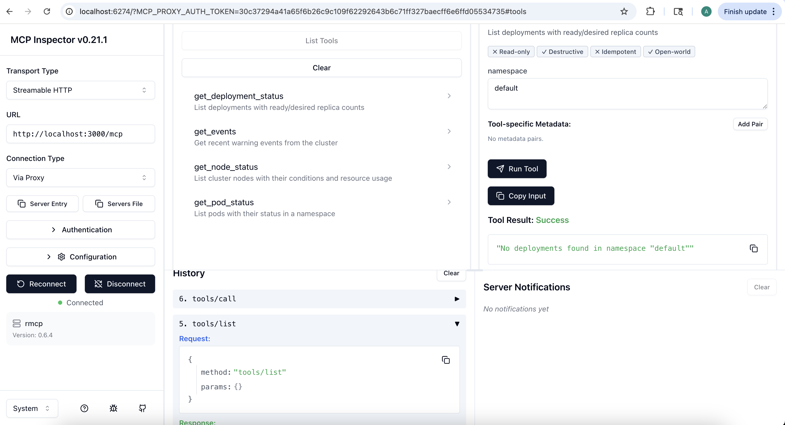

# MCP Advanced Features: Sampling, Elicitation & Apps

Research document covering real technical and business use cases for MCP (Model Context Protocol) advanced features.

---

## 1. MCP Sampling

### Overview

MCP Sampling reverses the typical client-server flow: instead of only the client calling the LLM, **MCP servers can request LLM completions through the client**. This enables servers to implement agentic behaviors without direct access to LLM APIs.

```
User → Client → Server (tool call)
                  │
            Server needs LLM reasoning
                  │
            Server → Client (sampling/createMessage)
                  │
            Client → LLM → response → Server
                  │
            Server continues → returns final result
```

### How It Works

1. Server sends a `sampling/createMessage` JSON-RPC request to the client
2. The request includes messages, model preferences, system prompt, and generation parameters
3. **Human-in-the-loop**: the client shows the request to the user for approval
4. Client forwards to its LLM and returns the response to the server
5. Supports multi-turn with tool use — if LLM returns `stopReason: "toolUse"`, server executes the tool and sends a follow-up

**Request example:**

```json
{
  "method": "sampling/createMessage",
  "params": {
    "messages": [
      {
        "role": "user",
        "content": { "type": "text", "text": "Analyze this deployment log..." }
      }
    ],
    "modelPreferences": {
      "hints": [{ "name": "claude-sonnet-4-5-20250514" }],
      "intelligencePriority": 0.8,
      "speedPriority": 0.5,
      "costPriority": 0.3
    },
    "maxTokens": 1000
  }
}
```

### Key Technical Details

- **Model preferences** are abstract: `hints` (suggested models), `costPriority`, `speedPriority`, `intelligencePriority` (all 0-1 scale)
- **includeContext**: controls what context the client includes (`none`, `thisServer`, `allServers`)
- **Security**: human approval is mandatory — clients must show prompts and let users edit before sending
- Server capabilities declared as `"sampling": {}` during initialization

### Real Technical & Business Use Cases

| Use Case | Description | Value |
|----------|-------------|-------|
| **Incident Root Cause Analysis** | SRE MCP server collects metrics, logs, and alerts during an incident, then asks LLM to analyze patterns and suggest root cause | Reduces MTTR by automating initial triage |
| **Automated Code Review** | CI/CD server collects git diff, asks LLM to identify bugs, security issues, and style violations | Scales code review without bottlenecking senior engineers |
| **Content Moderation** | Server receives user-generated content, asks LLM to classify against policy rules | Consistent moderation at scale with human oversight |
| **Data Enrichment Pipeline** | ETL server processes raw records, asks LLM to extract entities, generate tags, or normalize formats | Automates manual data cleaning work |
| **Customer Support Routing** | Helpdesk server receives ticket text, asks LLM to classify priority and department | Faster ticket routing without manual triage |
| **E-commerce Product Descriptions** | Catalog server takes product specs, asks LLM to generate marketing copy | Scales content creation for large catalogs |
| **Security Alert Triage** | SIEM server collects alerts, asks LLM to assess severity and recommend response actions | Reduces alert fatigue for security teams |
| **Infrastructure Drift Detection** | Server compares desired vs. actual state, asks LLM to explain discrepancies in human terms | Makes IaC drift understandable to non-experts |

### References

- [MCP Sampling Specification](https://modelcontextprotocol.io/specification/draft/client/sampling)
- [Sampling Concepts](https://modelcontextprotocol.io/docs/concepts/sampling)
- [Flipping the flow: MCP sampling lets servers ask the AI for help (WorkOS)](https://workos.com/blog/mcp-sampling)

---

## 2. MCP Elicitation

### Overview

MCP Elicitation allows servers to **request user input at runtime** during tool execution. The server pauses, asks the client to present a form or URL, waits for the user's response, then continues processing.

### Two Modes

**Form Mode (in-band)** — server defines a JSON Schema, client renders a form:

```json
{
  "method": "elicitation/create",
  "params": {
    "mode": "form",
    "message": "Configure deployment target",
    "requestedSchema": {
      "type": "object",
      "properties": {
        "environment": {
          "type": "string",
          "enum": ["staging", "production"],
          "default": "staging"
        },
        "replicas": {
          "type": "integer",
          "minimum": 1,
          "maximum": 10
        }
      },
      "required": ["environment"]
    }
  }
}
```

**URL Mode (out-of-band)** — server provides a URL for the user to visit externally:

```json
{
  "method": "elicitation/create",
  "params": {
    "mode": "url",
    "url": "https://auth.example.com/oauth/authorize?...",
    "message": "Please authorize access to your GitHub account"
  }
}
```

### Key Differences Between Modes

| Aspect | Form Mode | URL Mode |
|--------|-----------|----------|
| Data flow | Through MCP client | Directly to external service |
| Sensitivity | Non-sensitive data only | Passwords, API keys, payments |
| Client sees data | Yes | No |
| Typical use | Configuration, preferences | OAuth, payments, credentials |

### Response Actions

Users can respond with three actions:
- `accept` — user provided data (form mode includes the data)
- `decline` — user explicitly rejected the request
- `cancel` — user dismissed without explicit choice

### Real Technical & Business Use Cases

| Use Case | Mode | Description | Value |
|----------|------|-------------|-------|
| **OAuth Authorization** | URL | Server needs access to GitHub/Slack/Salesforce, redirects user to OAuth flow | Secure third-party integration without exposing tokens to client |
| **Deployment Approval Gate** | Form | Server asks "Deploy v2.3 to production? Replicas: [3]" before proceeding | Human-in-the-loop for critical operations |
| **API Key Configuration** | URL | User securely enters credentials on server's own page | Keys never pass through the MCP client |
| **Incident Escalation** | Form | Server asks which team to page, severity level, and custom message | Structured input for critical decisions |
| **Multi-step Wizard** | Form | Database migration tool asks for target schema, rollback strategy, execution window | Complex configuration without pre-hardcoding values |
| **Payment Processing** | URL | User completes Stripe checkout on external page | PCI compliance — card data never touches MCP |
| **Environment Selection** | Form | CI/CD tool asks which cluster and namespace to target | Runtime flexibility without separate config files |
| **User Consent** | Form | Server asks user to confirm data processing terms before accessing PII | Compliance with GDPR/privacy requirements |

### Security Considerations

- **Form mode**: never request sensitive data (passwords, API keys, PII)
- **URL mode**: never include pre-authenticated URLs; bind requests to user identity
- **Clients**: must show which server is requesting, provide decline/cancel options
- **Phishing prevention**: server must verify the same user who initiated the flow completes it

### References

- [MCP Elicitation Specification](https://modelcontextprotocol.io/specification/draft/client/elicitation)
- [MCP elicitation: Request user input at runtime (WorkOS)](https://workos.com/blog/mcp-elicitation)
- [How To Implement Elicitation With MCP (The New Stack)](https://thenewstack.io/how-to-implement-elicitation-with-model-context-protocol/)

---

## 3. MCP Apps

### Overview

MCP Apps is an extension that lets servers return **interactive HTML UIs** rendered directly inside the conversation. Instead of text-only tool results, tools can return dashboards, forms, visualizations, and controls that run as sandboxed iframes.

### How It Works

```
1. Tool declares UI:  _meta.ui.resourceUri = "ui://dashboard"
2. Client preloads the HTML resource
3. User calls the tool
4. Client renders HTML in sandboxed iframe inside the chat
5. App communicates with server via postMessage-based JSON-RPC
6. App can call tools, update state, send messages back
```

### Architecture

```
┌─────────────────────────────────────────┐
│         MCP Client (Claude, etc.)       │
│                                         │
│  ┌───────────────────────────────────┐  │
│  │     Sandboxed iframe (MCP App)    │  │
│  │     • No parent DOM access        │  │
│  │     • postMessage communication   │  │
│  │     • Can call MCP tools          │  │
│  │     • React/Vue/Svelte/Vanilla    │  │
│  └───────────────────────────────────┘  │
└─────────────────────────────────────────┘
              │ MCP Protocol
         ┌────────────────┐
         │   MCP Server   │
         │  • Serves HTML │
         │  • Handles tools│
         └────────────────┘
```

### Tool Definition with UI

```json
{
  "name": "cluster_dashboard",
  "description": "Interactive Kubernetes cluster health dashboard",
  "_meta": {
    "ui": {
      "resourceUri": "ui://dashboard",
      "permissions": [],
      "csp": {
        "default-src": ["'self'"],
        "script-src": ["'self'"]
      }
    }
  }
}
```

### UI Resource Response

```json
{
  "uri": "ui://dashboard",
  "mimeType": "text/html;profile=mcp-app",
  "blob": "<html>...</html>"
}
```

### Key Technical Details

- **Security**: iframe sandbox prevents DOM access, cookie theft, navigation; CSP controls external scripts
- **Communication**: postMessage-based JSON-RPC (same format as MCP, different transport)
- **Framework-agnostic**: official starters for React, Vue, Svelte, Preact, Solid, Vanilla JS
- **SDK**: `@modelcontextprotocol/ext-apps` provides AppBridge for rendering and communication
- **Bidirectional**: app can call server tools; host can push updates to app

### Real Technical & Business Use Cases

| Use Case | Description | Value |
|----------|-------------|-------|
| **Kubernetes Health Dashboard** | Interactive pod/node/deployment status with drill-down, filters by namespace | Visual cluster overview without leaving the conversation |
| **Log Viewer** | Real-time log streaming with search, filters, and severity highlighting | Faster debugging during incidents |
| **Sales Analytics** | Charts with filters by region, time period, product category | Data exploration without separate BI tool |
| **Deployment Wizard** | Multi-step form with validation, environment selection, rollback options | Guided deployments with guardrails |
| **3D/Map Visualization** | Geographic data on CesiumJS globe, Three.js 3D models | Rich spatial data in context of conversation |
| **PDF/Document Viewer** | Pan, zoom, search within documents inline | No context-switching to external apps |
| **System Monitor** | Real-time CPU, memory, network metrics with auto-refresh | Live observability in the chat |
| **Risk Assessment Matrix** | Interactive risk heat map with drill-down into specific risks | Visual risk management for stakeholders |
| **CI/CD Pipeline View** | Pipeline stages with status, logs, retry buttons | Operate CI/CD without leaving the agent |
| **Budget Allocator** | Interactive what-if scenarios for budget distribution | Financial planning with instant feedback |

### Client Support

Currently supported by: Claude (web & Desktop), VS Code GitHub Copilot, Goose, Postman, MCPJam.

### References

- [MCP Apps Overview](https://modelcontextprotocol.io/extensions/apps/overview)
- [MCP Apps Blog Announcement](https://blog.modelcontextprotocol.io/posts/2026-01-26-mcp-apps/)
- [MCP-UI Technical Deep Dive (WorkOS)](https://workos.com/blog/mcp-ui-a-technical-deep-dive-into-interactive-agent-interfaces)
- [GitHub: ext-apps with examples](https://github.com/modelcontextprotocol/ext-apps/)

---

## Feature Comparison

| Aspect | Sampling | Elicitation | Apps |
|--------|----------|-------------|------|
| **Direction** | Server → Client → LLM | Server → Client → User | Server → Client (renders UI) |
| **Purpose** | Get LLM reasoning | Get user input | Rich interactive UI |
| **Initiated by** | Server during tool execution | Server during tool execution | Tool result |
| **Security model** | Human approval required | User consent, mode-based privacy | iframe sandbox + CSP |
| **Data flow** | Prompts visible to client | Form: visible / URL: hidden | Sandboxed, controlled |
| **Spec status** | Draft | Draft | Extension |

## Combined Use Case Example: SRE Incident Response

A real-world scenario combining all three features:

1. **Sampling** — Server collects metrics and logs, asks LLM: "What's the likely root cause of this latency spike?"
2. **Elicitation** — Server asks the user: "LLM suggests scaling the API deployment. Approve scaling to 5 replicas?" (form mode)
3. **Apps** — Server returns an interactive dashboard showing real-time metrics, deployment status, and a "Rollback" button

This creates a complete **human-in-the-loop agentic workflow** where the AI reasons about the problem, the human approves actions, and the UI provides situational awareness — all within a single conversation.

---

## MCP Inspector

The [MCP Inspector](https://github.com/modelcontextprotocol/inspector) is the official developer tool for testing and debugging MCP servers.

### Usage

```bash
# Launch Inspector UI
npx @modelcontextprotocol/inspector@0.21.1

# Open browser, change transport to "Streamable HTTP"
# Enter server URL: http://localhost:3000/mcp
# Click Connect
```

### Connecting to a Kubernetes KMCP Server

```bash
# Port-forward the MCP server pod
kubectl port-forward -n kagent pod/<k8s-health-checker-pod> 3000:3000

# Launch Inspector and connect via UI
npx @modelcontextprotocol/inspector@0.21.1
```

### Inspector UI Features

- **Tools tab** — lists all tools, input forms from JSON schema, execute and view responses
- **Resources tab** — browse available resources with URIs and MIME types
- **Prompts tab** — test prompt templates with custom arguments
- **Logs pane** — server notifications and debug output

### Screenshot



*MCP Inspector connected to the k8s-health-checker KMCP server, showing 4 tools: get_pod_status, get_node_status, get_deployment_status, get_events.*

### References

- [MCP Inspector Docs](https://modelcontextprotocol.io/docs/tools/inspector)
- [GitHub: modelcontextprotocol/inspector](https://github.com/modelcontextprotocol/inspector)
